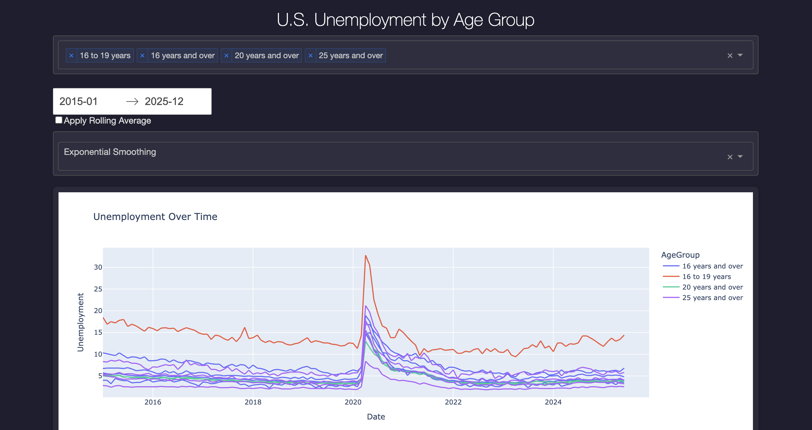

# 📊 U.S. Unemployment Dashboard

An interactive data visualization dashboard built with **Dash**, **Plotly**, and **StatsModels**, enabling users to explore U.S. unemployment trends across different **age groups** and **time periods**, with built-in **forecasting** features using **Exponential Smoothing**, **ARIMA**, and **Prophet**.



---

## 🚀 Features

- 📅 **Time Series Explorer**: Visualize unemployment trends over time by age group.
- 🔍 **Interactive Filters**: Dropdowns, checklists, and date pickers for full control.
- 📈 **Forecasting Module**:
  - Choose between Exponential Smoothing, ARIMA, and Prophet.
  - View forecasted values alongside historical data.
  - Includes **confidence bands** for uncertainty.
- 📊 **Monthly and YOY Trends**: Compare monthly averages and year-over-year changes.
- 🌡️ **Heatmap**: Visualizes YOY change intensity across age groups and years.
- 🎨 **Custom Dark Theme**: Clean, professional UI with Bootstrap-inspired styling.

---

## 📂 Project Structure

📁 data/
└── CombinedUnemplpymentData.csv
📁 assets/
└── custom.css # Dark mode and layout styling
└── demo_screenshot.png # Optional: add UI screenshot
📄 app.py # Main Dash app
📄 requirements.txt # Dependencies


---

## 📦 Installation

```bash
# Clone the repo
git clone https://github.com/your-username/unemployment-dashboard.git
cd unemployment-dashboard

# Create virtual environment
python -m venv venv
source venv/bin/activate  # On Windows use `venv\Scripts\activate`

# Install dependencies
pip install -r requirements.txt

# Run the app
python app.py


